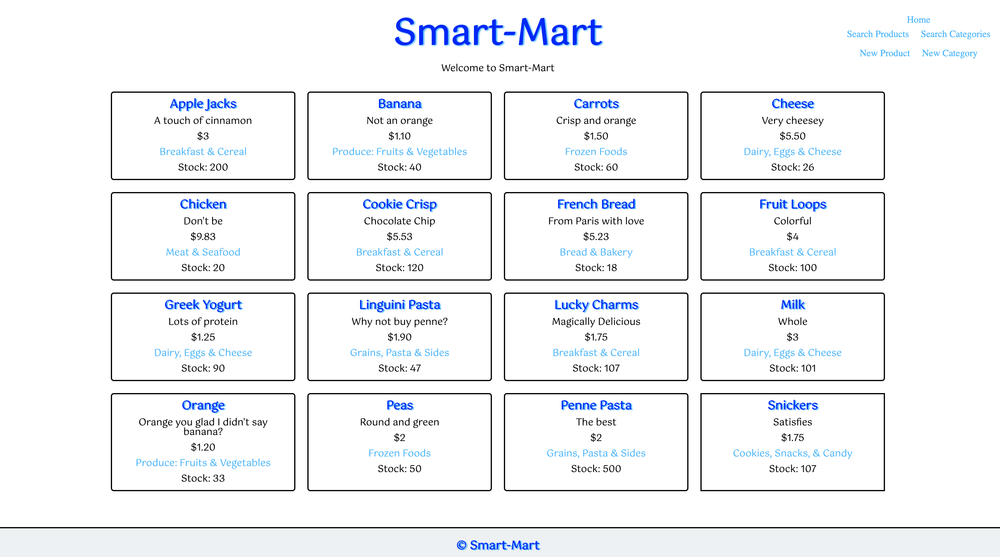

# Store Inventory 

Deployed:

This is store inventory website I made while following the Odin Project's curriculum. This website displays 16 base products and allows the user to search for products, browse by category, and enter and update new products and categories (as if they were an employee in charge of displaying the store's products). I used MongoDB to store information pertaining to the produts. This website makes use of express as a server framework and uses Handlebars as the view engine to display various pages with user inputs. Basic Regular Expression validation techniques are used to ensure proper field entries.  

